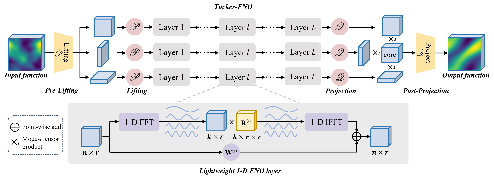

# Tucker-FNO
Official code for "Tucker-FNO: Tensor Tucker-Fourier Neural Operator and its Universal Approximation Theory" (ICLR 2026).



This repo contains two experiments:
1. **PDE operator learning** in `PDE/`
1. **Signal recovery** in `signal_recovery/`


## Experiment 1: Signal Recovery
**Scripts**
- Denoising: `signal_recovery/denoise_tucker_FNO.py`
- Inpainting: `signal_recovery/inpaint_tucker_FNO.py`


**How to run**
```bash
cd signal_recovery
python denoise_tucker_FNO.py
python inpaint_tucker_FNO.py
```

**Outputs**
- Checkpoints/logs are written under `signal_recovery/tucker_FNO/<data>/<param>/...`
- TensorBoard logs under `.../tensorboard_logs`

## Experiment 2: PDE Operator Learning
**Script:** `PDE/Tucker_FNO_plas.py`

**How to run**
```bash
cd PDE
python Tucker_FNO_plas.py 
```


 
